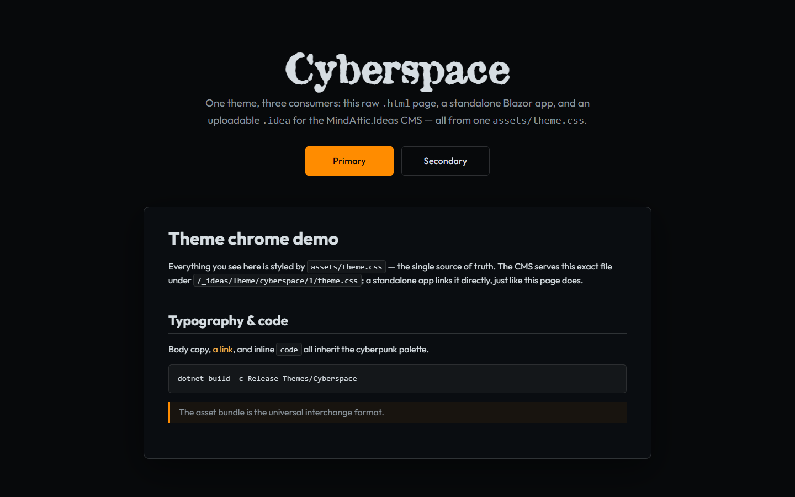
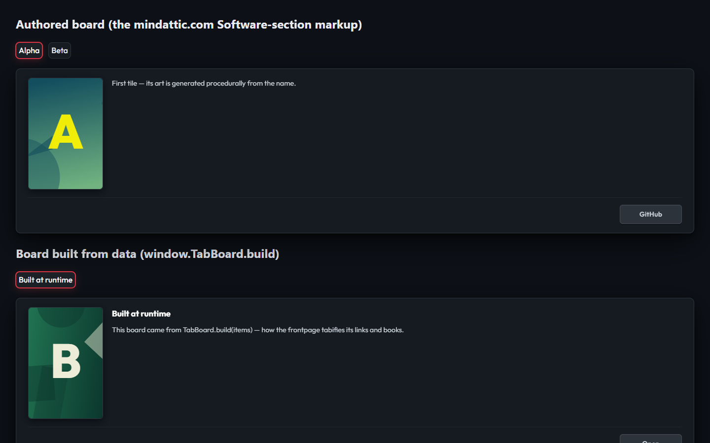
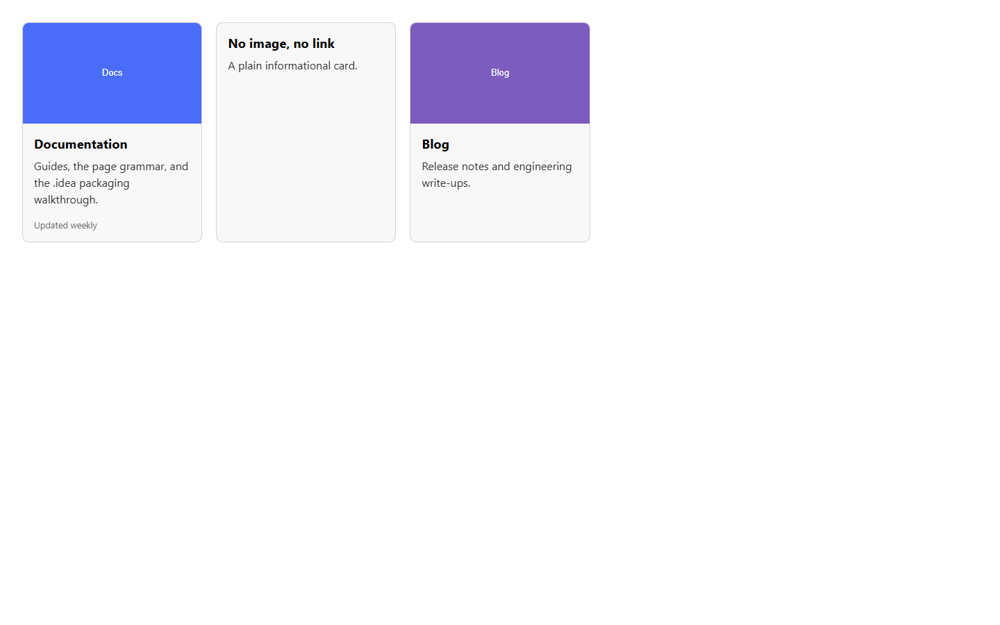

# MindAttic.Ideas.Library

Retired first-party library of .idea themes and widgets for the MindAttic.Ideas CMS, each owning its own JS/CSS/HTML bundle. Merged into MindAttic.Ideas under library/ on 2026-06-12.

[](https://github.com/mindattic/MindAttic.Ideas/tree/master/library) [](Directory.Build.props) [](MindAttic.Ideas.Library.slnx)



This repository is retired. On 2026-06-12 the library was merged into the CMS repo as [MindAttic.Ideas/library](https://github.com/mindattic/MindAttic.Ideas/tree/master/library), and all new work happens there. The GitHub repo is archived; it holds the component sources as they stood at that merge.

## Why

- Every first-party theme and widget lived in one repo instead of one git repo per piece.
- Each component's `assets/` folder was the single source of truth, used unchanged by a raw HTML page, a standalone Blazor app and the CMS.
- Each component was its own tiny project, so each `.idea` could be versioned, packed and uploaded on its own.
- Components composed each other by string id, never by project reference, so nothing here was coupled to anything else.

## Features

One bundle, three consumers:

| Consumer | Takes the bundle as |
|---|---|
| Raw `.html` pages | links `assets/*.css` and `assets/*.js` directly (see each component's `demo.html`) |
| Standalone Blazor apps | references the component RCL, or links the same `assets/` |
| The MindAttic.Ideas CMS | uploads the packed `.idea`, with the assets bundled into `wwwroot/` |

What the solution builds (`MindAttic.Ideas.Library.slnx`):

- Themes (7): Cyberspace, Light, Dark, Spring, Summer, Autumn, Winter.
- MindAttic-specific widgets: OutfitFont, AtticFont, BackHomeM, Cyberspace (effects), SacredGeometry, Tooltip, TableOfContents, LegionPersonas, Frontpage, HelloWorld, Textbox.
- Baseline widget set: NavMenu, Breadcrumbs, Hero, Card, Accordion, Tabs, Gallery, Carousel, Callout, CodeBlock, VideoEmbed, ContactForm, SocialLinks, BackToTop, Footer.
- The mindattic.com set: TabBoard, PinFooter, WebSnapshot.

The `Widgets/ModalPopup` project exists on disk but is not listed in the solution. The full catalog, with keys, versions and composition, is [docs/data/components.json](docs/data/components.json).





## Quick start

To look at a component, serve the repo over HTTP and open its demo page; no build is needed:

```powershell
git clone https://github.com/mindattic/MindAttic.Ideas.Library.git
cd MindAttic.Ideas.Library
python -m http.server 8000
```

Then open `http://localhost:8000/Themes/Cyberspace/demo.html` or any `Widgets/<Name>/demo.html`. Demo pages exist for the Cyberspace theme and for Accordion, BackToTop, Breadcrumbs, Callout, Card, Carousel, CodeBlock, ContactForm, Footer, Gallery, Hero, NavMenu, PinFooter, SocialLinks, TabBoard, Tabs, VideoEmbed and WebSnapshot.

For current, buildable components use [MindAttic.Ideas/library](https://github.com/mindattic/MindAttic.Ideas/tree/master/library) instead.

## Building and packing

The projects reference the CMS's `MindAttic.Ideas.Abstractions` project in a sibling `MindAttic.Ideas` checkout. `Directory.Build.props` sets that path once (override `IdeasAbstractionsProject` if your layout differs) with `Private="false"` and `ExcludeAssets="runtime"`, so the packed `bin/` holds exactly one DLL.

```powershell
dotnet build -c Release Themes/Cyberspace
dotnet run --project ../MindAttic.Ideas/src/MindAttic.Ideas.Sdk -- pack `
  --assembly Themes/Cyberspace/bin/Release/net10.0/MindAttic.Ideas.Theme.Cyberspace.dll `
  --out ./dist `
  --refs ../MindAttic.Ideas/src/MindAttic.Ideas.Abstractions/bin/Debug/net10.0
```

```powershell
dotnet build -c Release MindAttic.Ideas.Library.slnx
```

The widgets derive from `WidgetBase`, which today's MindAttic.Ideas SDK has deleted (the Widget kind split into Plugin and Component). These projects do not build against a current MindAttic.Ideas checkout (`error CS0246` on `WidgetBase`).

## Project layout

```text
Themes/          Cyberspace, Light, Dark, Spring, Summer, Autumn, Winter
Widgets/         one small project per widget, each with V1 code, assets/ and often demo.html
dist/            packed *.idea output (not present in this checkout)
docs/            Codex canon: BIBLE, AMENDMENTS, USER_STORIES, data/components.json
tools/codex.ps1  docs doctor and digest
Directory.Build.props         shared settings and the one Abstractions reference
MindAttic.Ideas.Library.slnx  the solution
```

There are no Pages here: pages are CMS database records (MAIL-LAW-8).

## Limitations

- Retired: no further changes land here. The live library, renamed to Themes, Plugins and Components, is in MindAttic.Ideas.
- Uses the pre-split `Widget` vocabulary and `WidgetBase`; see the build note above.

## Documentation

- [docs/BIBLE.md](docs/BIBLE.md): what the library is and is not, its architecture and laws.
- [docs/AMENDMENTS.md](docs/AMENDMENTS.md): pending decisions not yet folded into the bible (normally empty).
- [`docs/USER_STORIES.md`](docs/USER_STORIES.md): proof-cited stories.
- [docs/data/components.json](docs/data/components.json): the machine-readable catalog of every shipped `.idea`.
- [CLAUDE.md](CLAUDE.md): working rules for agents in this repo.

Run the docs check with `powershell -ExecutionPolicy Bypass -File tools\codex.ps1 doctor`.

## License

This repository has no LICENSE file. All rights reserved.

Part of [MindAttic](https://mindattic.com) — see more projects at [github.com/mindattic](https://github.com/mindattic). Related: [MindAttic.Ideas](https://github.com/mindattic/MindAttic.Ideas) (the CMS, and this library's current home), [MindAttic.UiUx](https://github.com/mindattic/MindAttic.UiUx).
